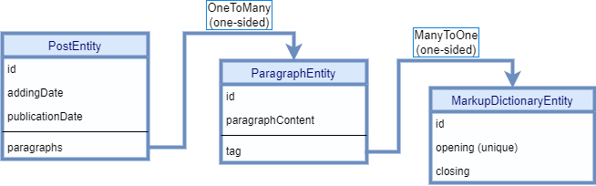
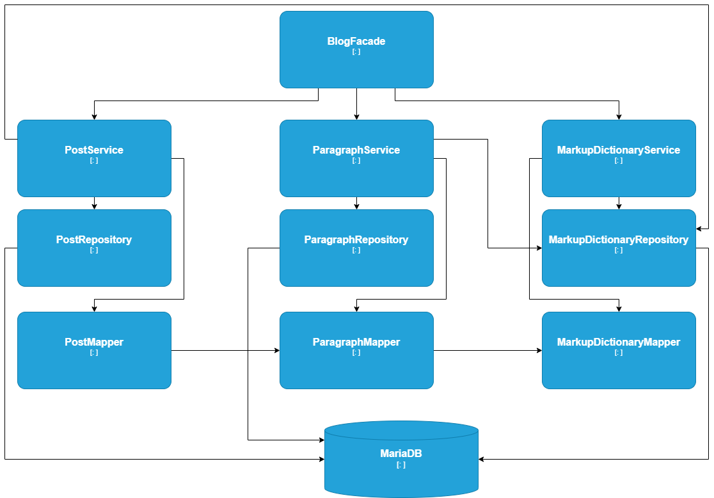
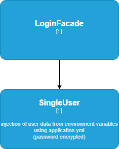
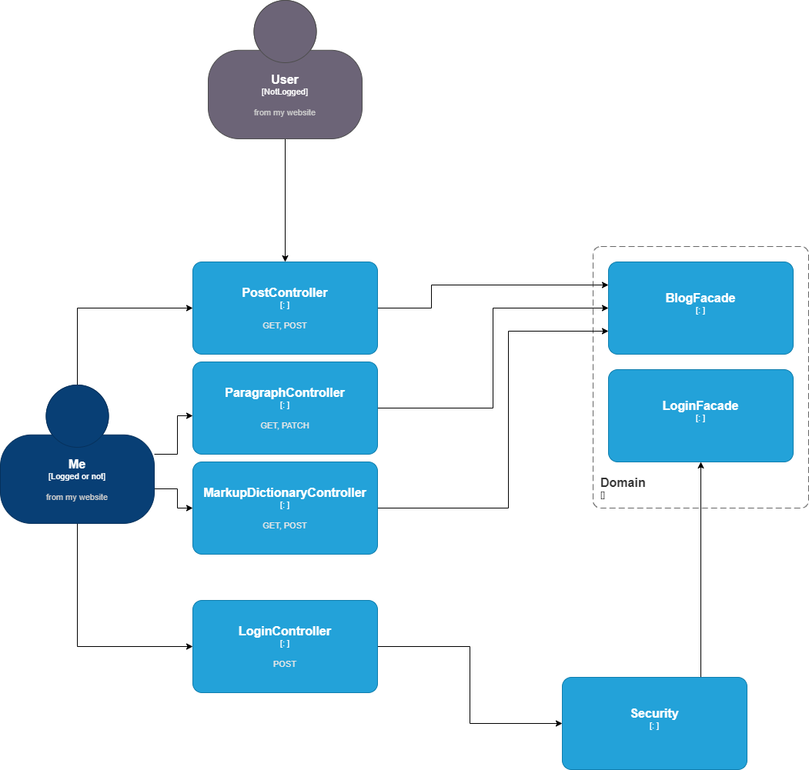
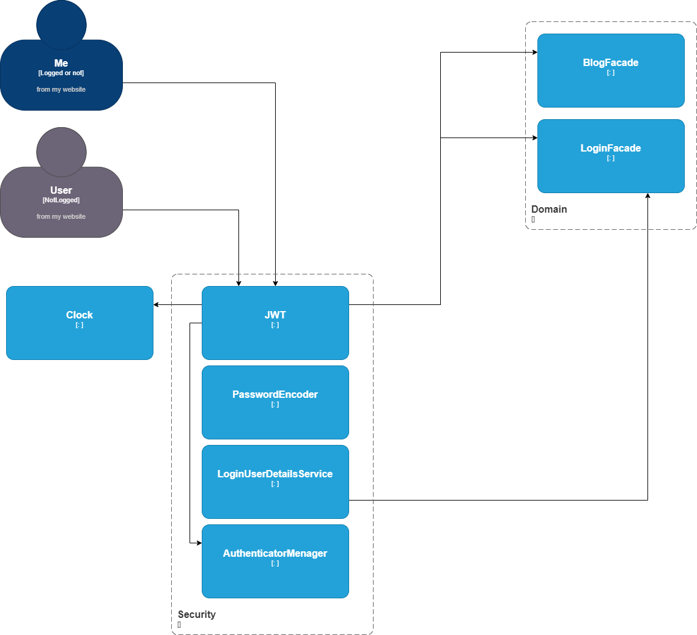

# My Backend App
## Introduction
### First
This project was launched as a backend for my website.
I wanted to build my portfolio.
Instead of creating Docker containers from ready-mades. I decided to write the backend for my site myself in Java, gaining experience in the topics I've been learning for the last few months. By the way, it will be a good part of my portfolio.
I wanted to understand the code I write well, so I put off writing tests for later, so as not to disturb the dependencies between classes, packages, etc. I wanted to focus on Spring, JPA, entities and dependencies. In the first phase, I limited the tests to manual ones using Postman.

## Technologies used

### Environment
>IntelliJ IDEA Ultimate
### Language, framework and more
>#### Basic
>* Java 17, Maven,
>* Spring Boot 3.0,
>* Docker, Docker Compose,
>* Postman for manual testing 
>#### Database
>* MariaDB 10.5.8 in docker container 
>* Spring Data JPA
>#### For security
>* Spring Security, JWT, 
>* BCrypt, 
>* SSL with Self Signed Certificate created in Keytool
>#### Other dependencies 
>* Jakarta Validation 
### Design Patterns and more
* Builder, Facade, Ports & Adapters,   
* SOLID

## Project architecture
### Domain Modules
#### Entities and his dependencies

#### Blog

#### Login

### Infrastructure

Security

## HTTP Methods

| METHOD  | URL                     | PAGINATION | AUTHENTICATION | DESCRIPTION                           | 
|---------|-------------------------|------------|----------------|---------------------------------------|
| GET     | /posts                  | yes        | no needed      | returning posts without unpublished   | 
| GET     | /posts/with-unpublished | yes        | needed         | returning posts with unpublished      |
| POST    | /posts                  | n/d        | needed         | adding new post                       |
| GET     | /paragraphs/{id}        | n/d        | needed         | returning paragraph with specified id |
| PATCH   | /paragraphs             | n/d        | needed         | update paragraph                      |
| GET     | /dict                   | n/d        | needed         | returning all markups                 |
| PATCH   | /dict                   | n/d        | needed         | add markup                            |
| PATCH   | /dict/{id}              | n/d        | needed         | delete markup                         |

## How to install project

