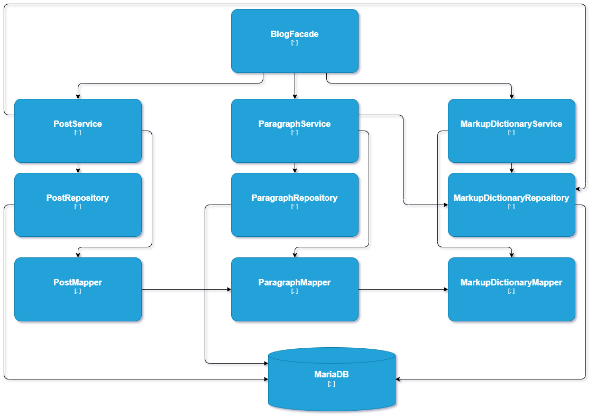

# My Backend App
## Introduction
### First
This project was started as a backend for my website.
I needed to build my portfolio.
Instead of creating some Docker containers with prefabs, I decided to write the backend for my website myself in Java, gaining experience in the topics I've been learning for the last few months.
I wanted to understand what I was writing, so I put off writing tests for later. I wanted to focus on Spring, JPA and dependencies between entities. In the first phase, I limited the tests to manual ones using Postman.

## Technologies used

### Environment
>IntelliJ IDEA Ultimate
### Language, framework and more
>#### Basic
>>Java 17, Maven,  
>>Spring Boot 3.0,  
>>Docker, Docker Compose,   
>>Postman for manual testing 
>#### Database
>>MariaDB 10.5.8 in docker container,   
>>Spring Data JPA
>#### For security
>>Spring Security, JWT, 
>>BCrypt, 
>>SSL with Self Signed Certificate created in Keytool
>#### Other dependencies 
>>Jakarta Validation 
### Design Patterns and more
>Builder, Facade, Ports & Adapters,   
>SOLID

## Project architecture
### Domain Modules
#### Entities and his dependencies

#### Blog

#### Login

### Infrastructure

Security

## HTTP Methods

| METHOD  | URL                     | PAGINATION | AUTHENTICATION | DESCRIPTION                           | 
|---------|-------------------------|------------|----------------|---------------------------------------|
| GET     | /posts                  | yes        | no needed      | returning posts without unpublished   | 
| GET     | /posts/with-unpublished | yes        | needed         | returning posts with unpublished      |
| POST    | /posts                  | n/d        | needed         | adding new post                       |
| GET     | /paragraphs/{id}        | n/d        | needed         | returning paragraph with specified id |
| PATCH   | /paragraphs             | n/d        | needed         | update paragraf                       |
| GET     | /dict                   | n/d        | needed         | returning all markups                 |
| PATCH   | /dict                   | n/d        | needed         | add markup                            |
| PATCH   | /dict/{id}              | n/d        | needed         | delete markup                         |

## How to install project
